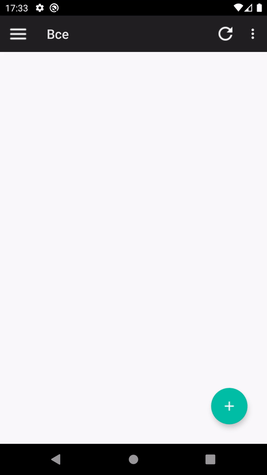
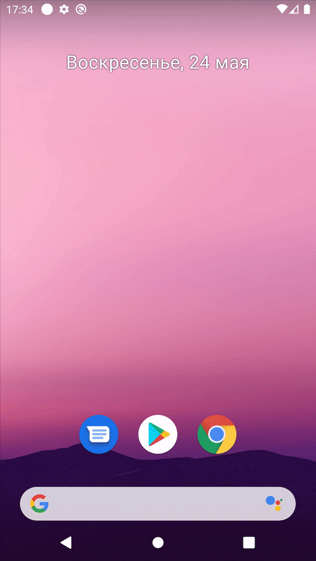

# salereminder-android
## Description
Первая курсовая работа, Android-приложение для отслеживания скидок на отдельные товары в интернет-магазинах, поддерживающих разметку schema.org. 

Написано на C# с использованием Xamarin.Android.

## Libs
Библиотеки и их применение:

* Firebase Cloud Messaging — создание push-уведомлений. 
* Json.NET — для парсинга json'ов.
* Для всего остального — инструменты Xamarin.Android и .NET.

## Backend
* Бэкенд, необходимый для работы приложения, доступен здесь:  https://github.com/konovalowo/salereminder-backend

* Его можно запустить локально, либо где-нибудь развернуть, указав адрес в константах.

## Demos
Добавление предметов                                       |  Уведомления
:---------------------------------------------------------:|:-----------------------------------------------------------:
| 
